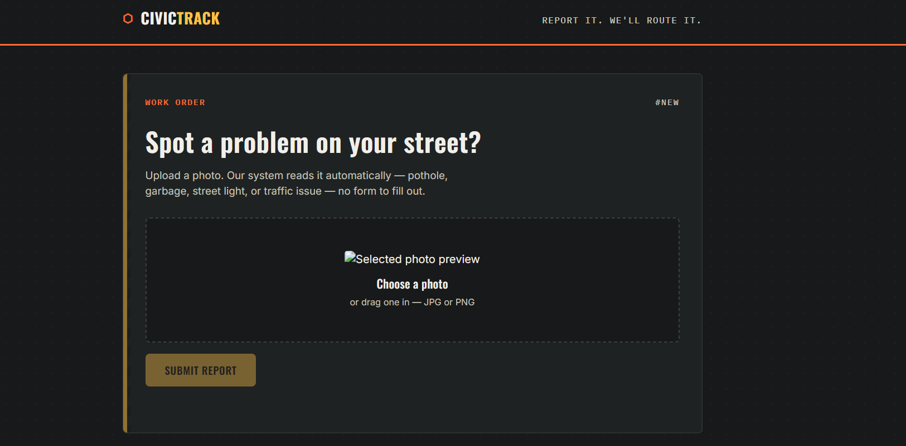
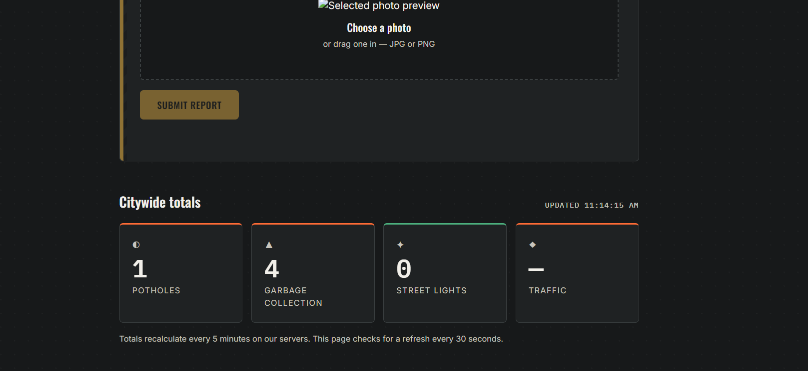
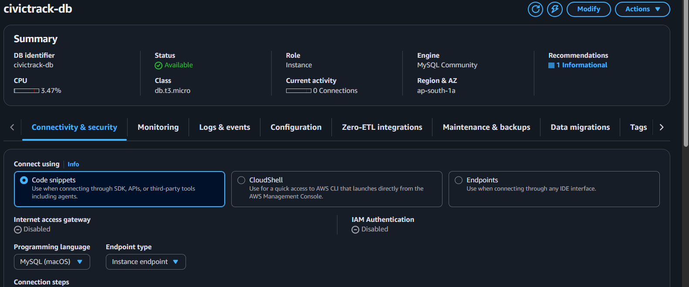
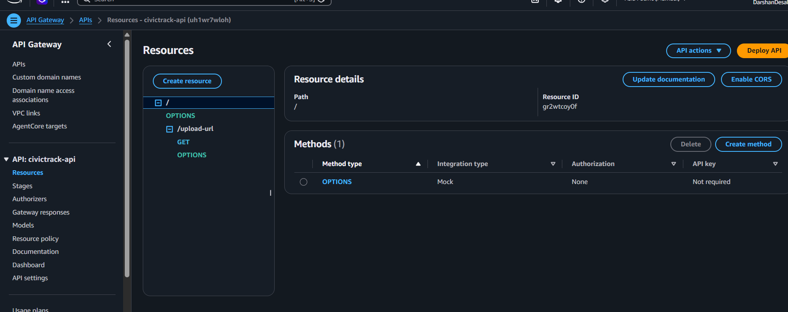
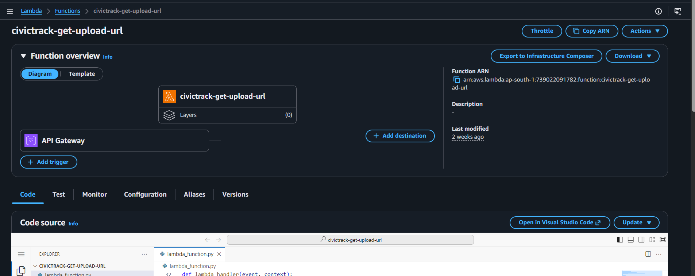
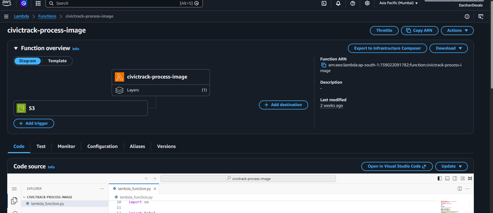
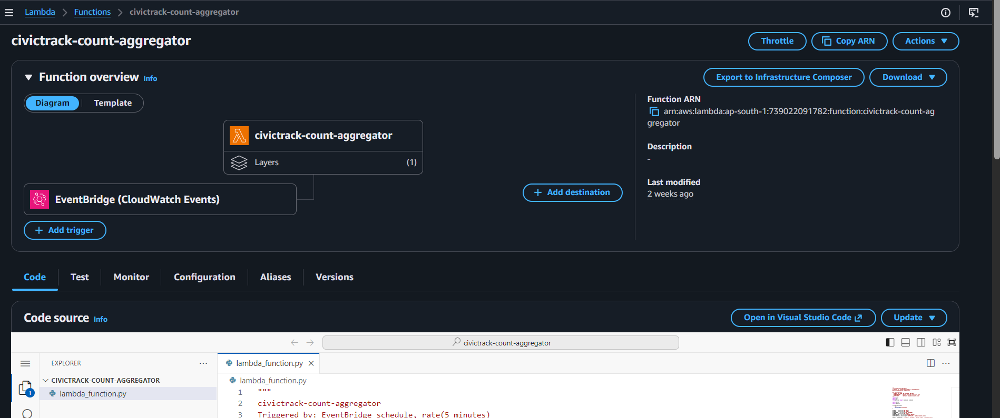

# 🚧 CivicTrack – AI Powered Civic Issue Reporting System

CivicTrack is a fully serverless AWS project that enables citizens to report civic issues simply by uploading an image. The uploaded image is analyzed using Amazon Rekognition to identify the type of issue such as potholes, garbage collection problems, street light failures, or traffic-related issues. The detected information is stored in Amazon RDS MySQL, and the dashboard automatically displays updated city-wide statistics.

---

# 🚀 Project Demo

## Home Page



---

## Output



---

# 📌 Features

- Upload an image through a responsive web interface
- Automatic issue detection using Amazon Rekognition
- Supports multiple issue categories
  - Pothole
  - Garbage Collection
  - Street Light
  - Traffic
- Stores reports in Amazon RDS MySQL
- Uses AWS Lambda for serverless processing
- Automatic image processing using S3 triggers
- Scheduled aggregation using Amazon EventBridge
- Dashboard showing city-wide issue counts
- Secure image upload using Pre-signed URLs
- Responsive user interface

---

# 🏗 System Architecture

```
                 Citizen

                    │

                    ▼

          Upload Image (Website)

                    │

                    ▼

             Amazon API Gateway

                    │

                    ▼

      Lambda - Get Upload URL

                    │

                    ▼

         Upload Image to Amazon S3

                    │

                    ▼

       S3 Event Trigger (Automatic)

                    │

                    ▼

      Lambda - Process Image

          │                  │

          │                  ▼

          │          Amazon Rekognition

          │                  │

          ▼                  ▼

      Amazon RDS      Detect Category

                    │

                    ▼

      EventBridge (Every 5 Minutes)

                    │

                    ▼

      Lambda - Count Aggregator

                    │

                    ▼

      Generate counts.json

                    │

                    ▼

        Amazon S3 (public folder)

                    │

                    ▼

           Frontend Dashboard
```

---

# ☁ AWS Services Used

| AWS Service | Purpose |
|-------------|---------|
| Amazon S3 | Stores uploaded images and counts.json |
| AWS Lambda | Image processing and aggregation |
| Amazon Rekognition | Detects issue category |
| Amazon API Gateway | REST APIs |
| Amazon RDS MySQL | Stores reports |
| Amazon EventBridge | Scheduled aggregation |
| IAM | Permissions and roles |

---

# 📂 Project Structure

```
CivicTrack
│
├── index.html
├── style.css
├── script.js
│
├── lambda
│     ├── civictrack-get-upload-url
│     ├── civictrack-process-image
│     └── civictrack-count-aggregator
│
├── images
│
└── README.md
```

---

# 🔄 Complete Workflow

### Step 1

User uploads an image through the website.

---

### Step 2

Frontend requests a pre-signed upload URL from API Gateway.

---

### Step 3

The **Get Upload URL Lambda** generates a secure pre-signed URL.

---

### Step 4

The browser uploads the image directly to Amazon S3.

---

### Step 5

Amazon S3 automatically triggers the **Process Image Lambda**.

---

### Step 6

The Process Image Lambda sends the uploaded image to Amazon Rekognition.

---

### Step 7

Amazon Rekognition detects the issue category.

Example:

- Pothole
- Garbage Collection
- Street Light
- Traffic

---

### Step 8

The Process Image Lambda stores the detection result inside Amazon RDS.

---

### Step 9

Every five minutes Amazon EventBridge triggers the **Count Aggregator Lambda**.

---

### Step 10

The Count Aggregator Lambda queries Amazon RDS and generates a new `counts.json` file.

---

### Step 11

The frontend periodically fetches the updated `counts.json` file and displays the latest statistics.

---

# 📸 AWS Resources

## Amazon RDS



---

## API Gateway



---

## Upload URL Lambda



---

## Process Image Lambda



---

## Count Aggregator Lambda



---

# 🛠 Technologies Used

## Frontend

- HTML5
- CSS3
- JavaScript

## Backend

- Python
- AWS Lambda

## Database

- Amazon RDS MySQL

## Cloud Services

- Amazon S3
- Amazon Rekognition
- Amazon API Gateway
- Amazon EventBridge
- IAM

---

# 📋 Supported Categories

- 🛣 Pothole
- 🗑 Garbage Collection
- 💡 Street Light
- 🚦 Traffic

---

# 🔮 Future Enhancements

- User Authentication
- GPS Location Detection
- Email Notifications
- SMS Alerts
- Mobile Application
- Admin Dashboard
- Severity Prediction using AI
- Complaint Tracking System

---

# 👨‍💻 Author

**Darshan Desale**

AWS Cloud | AI/ML | Full Stack Developer

---

⭐ If you found this project useful, don't forget to star the repository.
